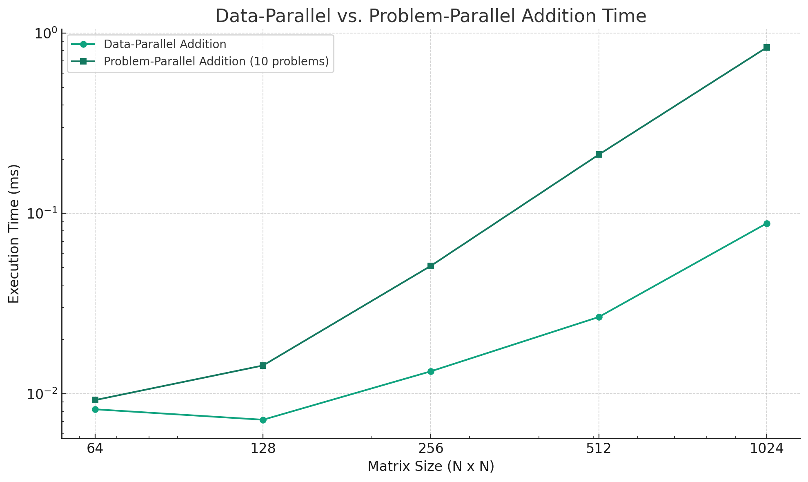
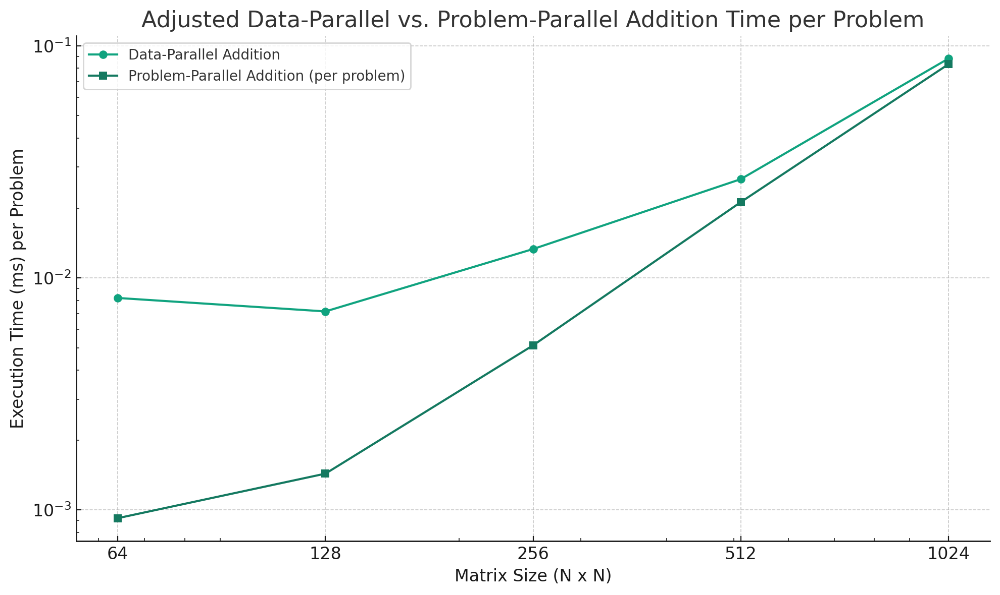

Data-parallel addition for N=64: 0.008192 ms

Problem-parallel addition for N=64 with 10 problems: 0.009216 ms

Data-parallel addition for N=128: 0.007168 ms

Problem-parallel addition for N=128 with 10 problems: 0.014336 ms

Data-parallel addition for N=256: 0.013312 ms

Problem-parallel addition for N=256 with 10 problems: 0.051200 ms

Data-parallel addition for N=512: 0.026624 ms

Problem-parallel addition for N=512 with 10 problems: 0.211968 ms

Data-parallel addition for N=1024: 0.088064 ms

Problem-parallel addition for N=1024 with 10 problems: 0.832512 ms

