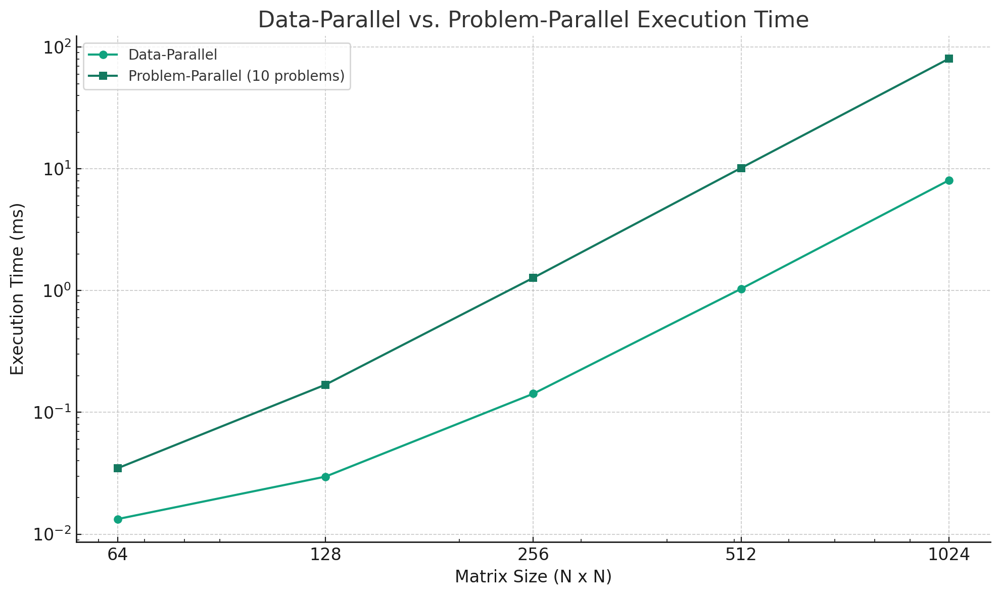
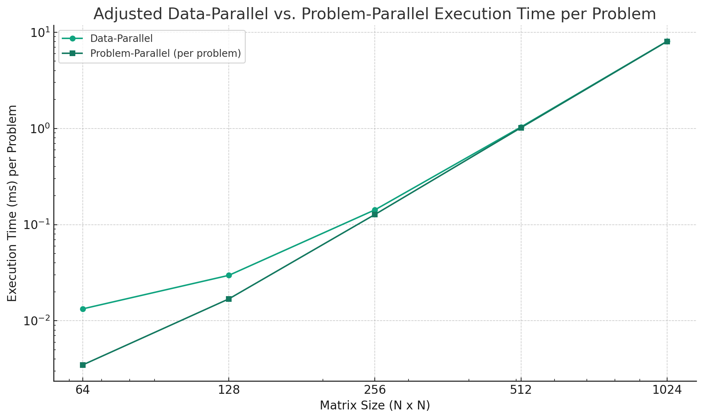

Data-parallel execution for N=64: 0.013312 ms

Problem-parallel execution for N=64 with 10 problems: 0.034816 ms

Data-parallel execution for N=128: 0.029696 ms

Problem-parallel execution for N=128 with 10 problems: 0.168960 ms

Data-parallel execution for N=256: 0.142336 ms

Problem-parallel execution for N=256 with 10 problems: 1.273856 ms

Data-parallel execution for N=512: 1.034240 ms

Problem-parallel execution for N=512 with 10 problems: 10.167296 ms

Data-parallel execution for N=1024: 8.048640 ms

Problem-parallel execution for N=1024 with 10 problems: 80.230400 ms

